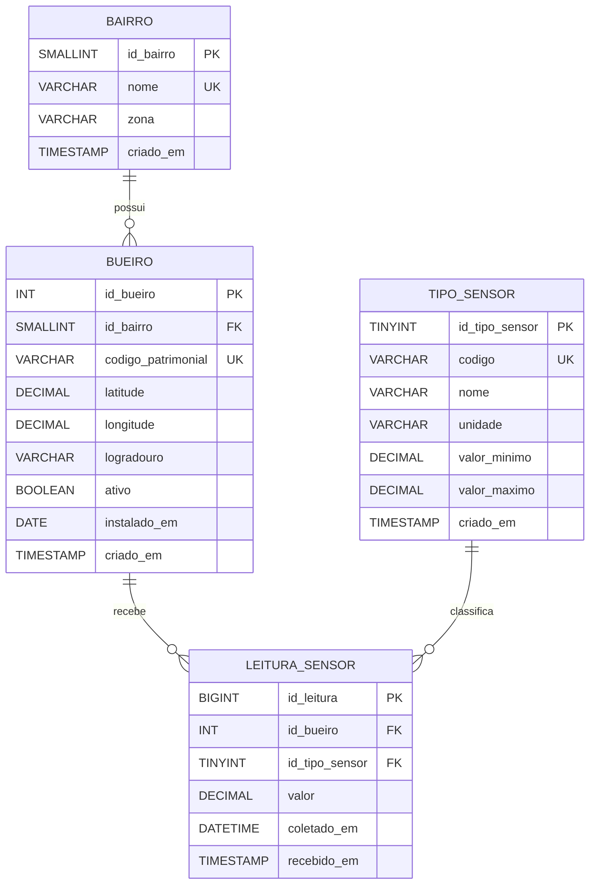

# Modelagem do Banco de Dados

## DER



## Dicionario de Dados

| Tabela | Campo | Tipo | Chave | Descricao |
| --- | --- | --- | --- | --- |
| bairro | id_bairro | SMALLINT UNSIGNED | PK | Identificador surrogate do bairro. |
| bairro | nome | VARCHAR(100) | UK | Nome unico do bairro. |
| bairro | zona | VARCHAR(40) | - | Regiao administrativa opcional. |
| bueiro | id_bueiro | INT UNSIGNED | PK | Identificador surrogate do bueiro monitorado. |
| bueiro | id_bairro | SMALLINT UNSIGNED | FK | Bairro onde o bueiro esta localizado. |
| bueiro | codigo_patrimonial | VARCHAR(30) | UK | Codigo operacional/patrimonial do ativo urbano. |
| bueiro | latitude | DECIMAL(9,6) | - | Coordenada geoespacial otimizada para area urbana. |
| bueiro | longitude | DECIMAL(9,6) | - | Coordenada geoespacial otimizada para area urbana. |
| bueiro | ativo | BOOLEAN | - | Indica se o bueiro participa das consultas operacionais. |
| tipo_sensor | id_tipo_sensor | TINYINT UNSIGNED | PK | Identificador surrogate do tipo de metrica. |
| tipo_sensor | codigo | VARCHAR(30) | UK | Codigo tecnico: OBSTRUCAO, PLUVIOMETRICO ou VAZAO. |
| tipo_sensor | unidade | VARCHAR(12) | - | Unidade de medida da leitura. |
| tipo_sensor | valor_minimo | DECIMAL(8,2) | - | Limite inferior valido. |
| tipo_sensor | valor_maximo | DECIMAL(8,2) | - | Limite superior valido, quando existir. |
| leitura_sensor | id_leitura | BIGINT UNSIGNED | PK | Identificador da leitura. |
| leitura_sensor | id_bueiro | INT UNSIGNED | FK | Bueiro que originou a leitura. |
| leitura_sensor | id_tipo_sensor | TINYINT UNSIGNED | FK | Tipo da metrica coletada. |
| leitura_sensor | valor | DECIMAL(8,2) | - | Valor capturado pelo sensor. |
| leitura_sensor | coletado_em | DATETIME(3) | IDX | Momento da coleta com precisao em milissegundos. |
| leitura_sensor | recebido_em | TIMESTAMP | - | Momento de chegada ao banco. |

## Normalizacao

1FN: todos os atributos sao atomicos. As leituras nao armazenam listas ou colunas repetidas para cada metrica; cada registro representa uma medicao de um tipo em um instante.

2FN: as tabelas usam chaves primarias simples e todos os atributos nao-chave dependem integralmente da chave da propria tabela. Em `leitura_sensor`, `valor` e `coletado_em` dependem de `id_leitura`; dados do bueiro e do tipo de sensor ficam nas suas dimensoes.

3FN: nao ha dependencia transitiva entre atributos nao-chave. O nome do bairro nao fica em `bueiro`; a unidade do sensor nao fica em `leitura_sensor`; ambos sao referenciados por chaves estrangeiras.

## Views Analiticas

### vw_leitura_atual_bueiro

Objetivo: retornar a ultima leitura de cada metrica por bueiro e calcular o status operacional.

Algebra relacional, em forma estendida:

```text
UltimaLeitura := leitura_sensor ⋈
  (id_bueiro, id_tipo_sensor, max(coletado_em)->ultima_coleta G leitura_sensor)

BaseAtual := bueiro ⋈ bairro ⋈ UltimaLeitura ⋈ tipo_sensor

vw_leitura_atual_bueiro :=
  id_bueiro, codigo_patrimonial, bairro.nome, latitude, longitude,
  max(valor onde codigo='OBSTRUCAO')->obstrucao_percentual,
  max(valor onde codigo='PLUVIOMETRICO')->indice_pluviometrico_mm,
  max(valor onde codigo='VAZAO')->vazao_litros_segundo,
  max(coletado_em)->ultima_coleta,
  case(...)->status_operacional
  G id_bueiro,codigo_patrimonial,bairro.nome,latitude,longitude (BaseAtual)
```

### vw_metricas_por_bairro

Objetivo: consolidar medias e quantidade de bueiros criticos por bairro.

```text
vw_metricas_por_bairro :=
  bairro,
  count(*)->total_bueiros,
  sum(status_operacional='Critico')->bueiros_criticos,
  avg(obstrucao_percentual)->media_obstrucao_percentual,
  avg(indice_pluviometrico_mm)->media_pluviometrica_mm,
  avg(vazao_litros_segundo)->media_vazao_litros_segundo
  G bairro (vw_leitura_atual_bueiro)
```

### vw_alertas_criticos

Objetivo: expor somente bueiros em nivel critico.

```text
vw_alertas_criticos :=
  sigma status_operacional='Critico' (vw_leitura_atual_bueiro)
```

## Consultas de Alta Performance

Os indices `ix_leitura_bueiro_tipo_tempo`, `ix_leitura_tipo_tempo` e `ix_leitura_tempo` aceleram:

- busca da ultima leitura por bueiro e tipo;
- series temporais por tipo de sensor;
- filtros por janela de tempo para graficos e alertas recentes.

As remocoes em cascata estao aplicadas nas relacoes `bairro -> bueiro`, `bueiro -> leitura_sensor` e `tipo_sensor -> leitura_sensor`, garantindo que registros dependentes sejam removidos sem sobras orfas.


